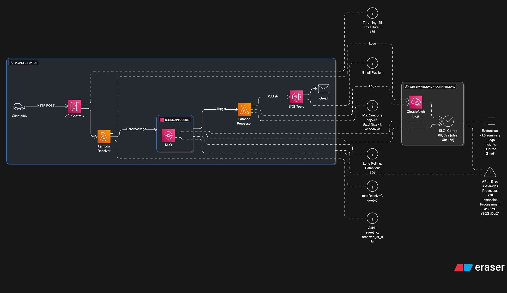

# Sistema de Alerta Temprana – Entregables

## Código Fuente
Estructura propuesta:
```
src/
  event_receiver/index.js   # Lambda HTTP: valida, encola en SQS (202 Accepted)
  event_processor/index.js  # Lambda SQS: detecta "Emergency", publica a SNS y loguea
template.yaml               # Infra como código (SAM)
k6_15rps_67s_car.js         # Carga: 15 rps x 67 s ≈ 1005 req
```
- **Receiver**: crea `event_id`, `received_at_utc`, valida lat/lon, envía a SQS.
- **Processor**: al detectar `type="Emergency"`, envía correo vía SNS y emite log `email_sent` con latencia.

## Decisiones de Arquitectura
- **API Gateway (REST) con Throttling 15 rps**: Cumple la restricción y evita sobrecargar backend.
- **SQS con DLQ**: Desacopla ingestión/proceso, absorbe picos y garantiza 100% de procesamiento (reintentos + DLQ).
- **Lambda Processor con MaximumConcurrency=10**: Limita instancias simultáneas sin consumir “reserved concurrency” de la cuenta.
- **BatchSize=1 / BatchingWindow=0**: Minimiza latencia end-to-end para correos < 30 s.
- **SNS (email a Gmail)**: Servicio administrado, entrega rápida de notificaciones y fácil de auditar.

## Atributo de Calidad Prioritario
**Latencia de notificación** (< 30 s, ideal < 15 s) sin sacrificar **confiabilidad** (entrega 100%).
- Se priorizó **tiempo de respuesta** mediante: lotes desactivados, concurrencia suficiente (10) y procesamiento inmediato (SQS trigger).
- **Confiabilidad** vía SQS + DLQ + reintentos administrados por Lambda.

## Diagrama de Arquitectura


## Tácticas de Arquitectura
- **Cola / Backpressure**: SQS amortigua picos, desacopla y evita pérdida de mensajes.
- **Limitación de Concurrencia**: `MaximumConcurrency=10` para cumplir restricción de instancias activas.
- **Eliminación de Batching**: `BatchSize=1`, `Window=0` reduce latencias de cola→procesamiento.
- **Manejo de Fallos**: DLQ con `maxReceiveCount`=3 permite análisis y reprocesamiento manual.
- **Observabilidad**: Logs en JSON con `event_id` para correlación y medición (receiver→processor).

## Logs de Ejecución (formatos)
### Recepción de emergencia (Receiver)
```json
{
  "level": "INFO",
  "event": "emergency_received",
  "event_id": "<uuid>",
  "vehicle_plate": "ABC123",
  "coordinates": {"latitude": 4.6097, "longitude": -74.0817},
  "received_at_utc": "<ISO8601>",
  "source": "receiver"
}
```

### Envío de correo (Processor)
```json
{
  "level": "INFO",
  "event": "email_sent",
  "event_id": "<uuid>",
  "to": "SNS->Gmail",
  "provider": "sns",
  "email_sent_at_utc": "<ISO8601>",
  "latency_ms_from_receive": 1234
}
```

## Consultas CloudWatch Logs Insights
**Processor (latencia p95):**
```sql
fields latency_ms_from_receive
| filter ispresent(latency_ms_from_receive)
| stats
  count() as total,
  pct(latency_ms_from_receive, 50) as p50_ms,
  pct(latency_ms_from_receive, 95) as p95_ms,
  max(latency_ms_from_receive) as max_ms
```

**Receiver (emergencias recibidas):**
```sql
fields @timestamp, event, event_id, vehicle_plate, received_at_utc
| filter event = "emergency_received"
| sort @timestamp asc
| limit 200
```

**Processor (correos enviados):**
```sql
fields @timestamp, event, event_id, email_sent_at_utc, latency_ms_from_receive
| filter event = "email_sent"
| sort @timestamp asc
| limit 200
```

## Prueba de Carga (k6)
```bash
API_URL="https://<api-id>.execute-api.<region>.amazonaws.com/prod/events" k6 run k6_15rps_67s_car.js --summary-export=summary.json
```
